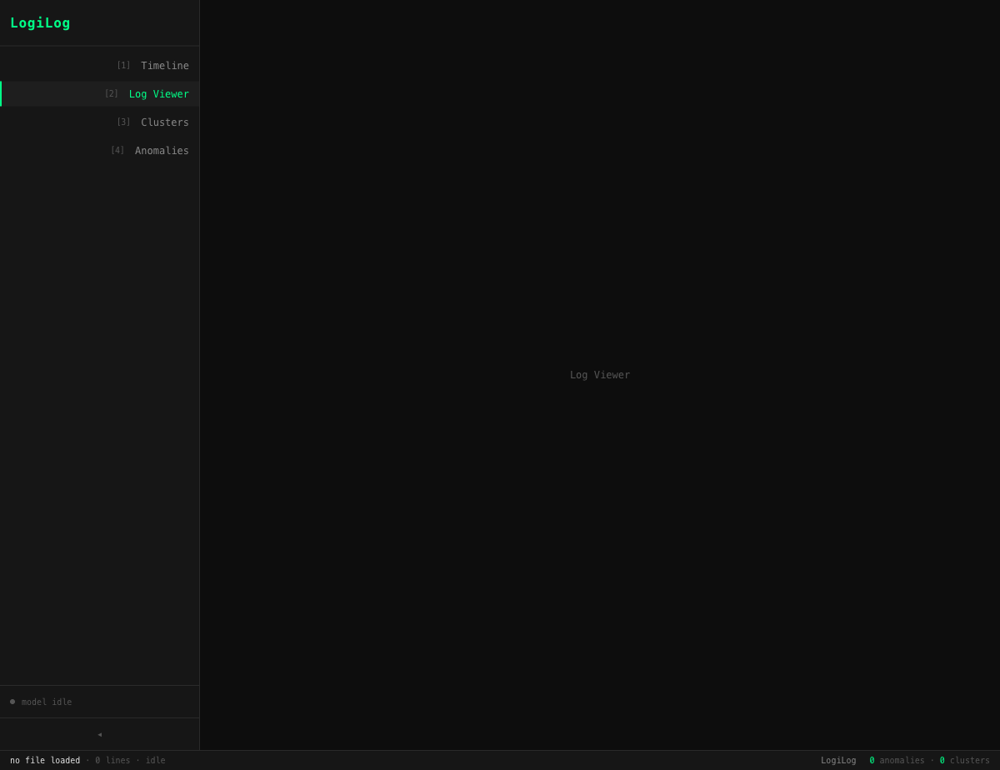
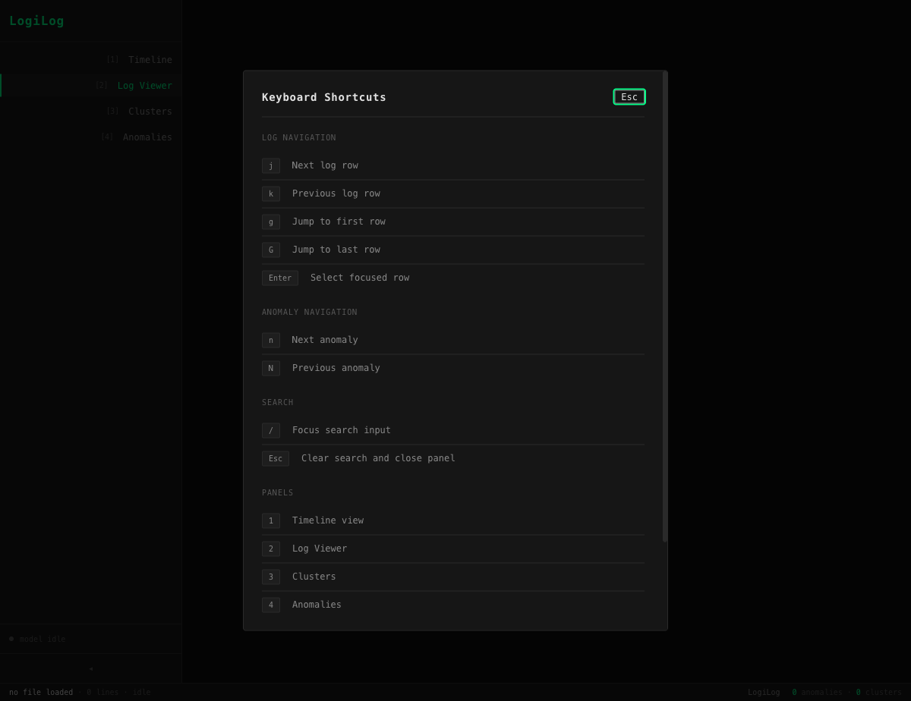

# LogiLog

**Browser-native semantic forensic log analysis — zero backend, zero cost, zero privacy risk.**

LogiLog runs entirely in your browser. Drop in a log file, and it uses on-device ML (WebGPU-accelerated transformer embeddings) to detect semantic anomalies, cluster repetitive noise, and surface root-cause context — all without sending a single byte to a server.



---

## Why LogiLog?

Traditional observability platforms (Datadog, Splunk, Grafana Cloud) charge $0.50–$2.00/GB ingested. A mid-sized SaaS with 50 TB/month of logs faces $25K–$100K/month in bills. Teams respond by downsampling or stopping logging altogether — losing the forensic data they need most during incidents.

LogiLog solves this by moving all computation into the browser:

| Problem | LogiLog's answer |
|---|---|
| Cloud platforms are expensive | Zero infrastructure, zero per-inference cost |
| Logs contain PII / credentials | Data never leaves your device |
| `grep` misses semantic patterns | Transformer embeddings understand meaning, not just text |
| Too much noise to find signal | ML clustering groups repetitive lines so you can ignore them |
| Root cause is buried in context | Smart Context captures the 50–100 lines that led to the failure |

---

## Features

### Semantic Anomaly Detection
Generates vector embeddings for each log line using a quantized transformer model, then scores each line by its cosine distance from normal patterns. Lines that are semantically unique — even if they don't contain the word "ERROR" — are surfaced as anomalies.

### Smart Context Forensic Capture
When an anomaly is detected, LogiLog automatically extracts the surrounding context: the 50–100 lines preceding the event that explain the failure chain. Instead of a naked error, you get the full story.

### Log Clustering
Groups semantically similar log lines into collapsible clusters. Repetitive background noise (health checks, cache hits, metrics collection) is collapsed so you can focus on what changed.

### Interactive Timeline
Visualizes log volume over time with AI-detected anomaly spikes highlighted. Designed for incident response — the mental model of "when did this start?" is answered at a glance.

### Vim-style Keyboard Navigation
Full keyboard control for power users and SREs navigating logs under pressure.



| Key | Action |
|---|---|
| `j` / `k` | Next / previous log row |
| `g` / `G` | Jump to first / last row |
| `Enter` | Select focused row |
| `n` / `N` | Next / previous anomaly |
| `/` | Focus search input |
| `Esc` | Clear search |
| `1`–`4` | Switch panels |
| `?` | Open this shortcuts modal |

### Export
Detected anomalies, clusters, and Smart Context results can be exported as JSON or CSV for post-incident reports or sharing with teammates.

---

## How It Works

All computation runs in Web Workers to keep the UI responsive:

```
Browser Tab
├── UI Thread (React 19 + Zustand)
├── Parse Worker       — streams and parses raw log file
├── Inference Worker   — runs transformer model via Transformers.js + WebGPU
└── IndexedDB          — caches parsed logs and model weights locally
```

**Model:** `Xenova/all-MiniLM-L6-v2` (q8, ~23 MB), cached in IndexedDB after first load. Subsequent loads go from ~30 seconds to under 3 seconds.

**Privacy:** The app is a static HTML/JS bundle. No network requests are made with your log data. The model weights are fetched once from HuggingFace CDN and cached locally.

---

## Getting Started

### Try it

Open the deployed app (GitHub Pages) — no install required.

### Run locally

```bash
# Install dependencies
npm install

# Start dev server
npm run dev
```

Then open `http://localhost:5173/LogiLog/`.

### Load a log file

Drag and drop any `.log`, `.txt`, `.gz`, or `.zip` file onto the app, or click to browse. The example file in this repo (`example.txt`) shows a realistic Redis connection pool exhaustion incident:

```
2026-03-14T09:15:16.001Z WARN  [redis-client] connection pool nearing capacity active=45 max=50
2026-03-14T09:15:18.213Z WARN  [redis-client] connection pool nearing capacity active=48 max=50
2026-03-14T09:15:22.778Z ERROR [redis-client] connection pool exhausted active=50 max=50
2026-03-14T09:15:22.780Z ERROR [task-service] request_id=bcc12fa2 failed to fetch tasks error="RedisPoolExhaustedError"
2026-03-14T09:15:31.002Z WARN  [kube-controller] restarting pod logilog-api-7fbd6c9f5f-l9k2p reason=readiness probe failed
```

LogiLog will detect the pool exhaustion as a semantic anomaly, cluster the repeated WARN lines, and surface the full failure chain as Smart Context.

---

## Browser Requirements

WebGPU is required for hardware-accelerated inference.

| Browser | Support |
|---|---|
| Chrome 113+ | Full (WebGPU + SharedArrayBuffer) |
| Edge 113+ | Full |
| Firefox | Partial (WebGPU behind flag) |
| Safari 18+ | Partial (WebGPU available) |

> **Note:** LogiLog requires `Cross-Origin-Opener-Policy: same-origin` and `Cross-Origin-Embedder-Policy: require-corp` headers for SharedArrayBuffer support. These are set automatically on GitHub Pages via the included `_headers` file.

---

## Development

```bash
npm run dev          # dev server
npm run build        # production build
npm run test         # unit tests (Vitest)
npm run test:e2e     # E2E tests (Playwright)
npm run typecheck    # TypeScript strict check
npm run lint         # ESLint
npm run lighthouse   # Lighthouse CI
```

### Tech Stack

| Layer | Choice |
|---|---|
| Framework | React 19, TypeScript (strict) |
| ML Runtime | Transformers.js v3, WebGPU backend |
| State | Zustand |
| Virtualization | react-window (handles millions of log lines) |
| Charts | Recharts |
| Build | Vite 6 |
| Tests | Vitest + Playwright |
| Deploy | GitHub Pages (static, zero backend) |

---

## Deployment

LogiLog is a static app — `npm run build` produces a `dist/` folder that can be hosted anywhere. The GitHub Actions CI/CD pipeline automatically builds and deploys to GitHub Pages on every push to `main`.

```bash
npm run build
# dist/ is ready to serve
```

---

## License

[MIT](LICENSE)
